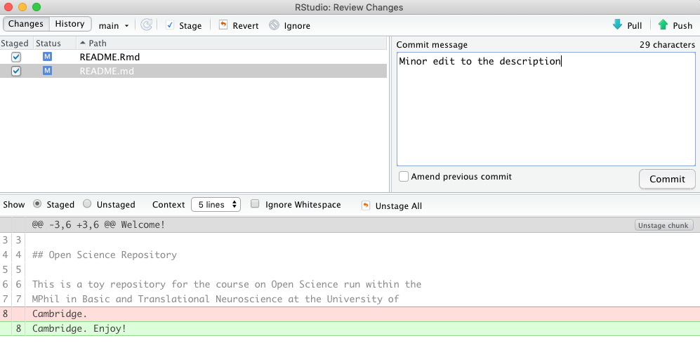

```{r setup, include=FALSE}
knitr::opts_chunk$set(echo = TRUE)
rmarkdown::find_pandoc()
```


# Welcome!
***

In this practical we will learn how to interface RStudio with GitHub. There are different ways to interact with GitHub including GitHub's Desktop App and the command line. If one needs flexibility, it is probably best to interface through the command line. However, for the most common tasks you can just avoid the need to switch between the command line and your coding environment by using the git functions integrated in RStudio.

<br/>


We will cover the following steps:

1. Set up git within RStudio.
2. Clone locally your GitHub repository.
3. Practice the  RStudio-GitHub workflow: pull, stage, commit, push.
4. Explore commit history and file history.

<br/>
<br/>

# Set up git within RStudio
***

We will use the {usethis} and {gitcreds} packages to configure git globally to all files on your computer.
Please note, the configuration needs to be done just once.

1. Install the required packages if you haven't already
```{r eval=FALSE, include=TRUE}
install.packages('usethis','gitcreds')
```


<br/>


2. Configure git with global commands 
```{r eval=FALSE, include=TRUE}
usethis::use_git_config(user.name = "MyGitHubUsername",user.email = "My@email.com")

#To prevent committing files to git that contain credentials - need to be used only once
usethis::git_vaccinate()

```

<br/>


3. Create a personal access token in place of a password for authentication to GitHub

```{r eval=FALSE, include=TRUE}
usethis::create_github_token(
  scopes = c("repo", "gist", "MyGitHubUsername:My@email.com"),
  description = "A_meaningful_name",
  host = "https://github.com"
)
```


This should open a browser window (probably you will have to confirm your GitHub password first) that allows you to choose what you can/cannot do with the new token. For now, we will create a token as below, but you can always create a new token later. 


{width=80%}

This will provide you with a new token to copy on your clipboard. Note: for security reasons, after you leave the page, you will not be able to see the token again. 

{width=80%}
<br/>


4. Store the personal access token. Select 'Replace these credentials' (option 2) and paste the token when asked.

```{r eval=FALSE, include=TRUE}
gitcreds::gitcreds_set()

```
{width=80%}

<br/>
<br/>

# Clone locally your GitHub repository
***

To 'clone' means to make a local copy of a remote GitHub repository. This only needs to be done once.

Now that you have introduced yourself to git, let's start a new Project:

1. Copy the URL of your GitHub repository
{width=80%}

<br/>


2. *File > New Project > Version Control > Git.* In the "Repository URL" field paste the URL from your GitHub repository. **Make sure that the Project directory name is the same as the GitHub repository** (e.g above 'os-repo'). Be intentional in choosing where to place the Project directory. 

<br/>


3. Click 'Create Project' to create a new directory which will include:
    * a directory linked to a remote GitHub repository
    * an RStudio Project file (.Rproj)
    * a .gitignore file listing all files not to be tracked
    * a README.md file with information about the the project
    
Note, the content of the repository has been automatically 'pulled' into your folder.
    
<br/>
<br/>


# Practice the  RStudio-GitHub workflow
***

1. Let's get starting filling this repo with some content, but first of all, it's a good practice to give some 'structure' to our repository. I usually add the following folders:
  
  * Scripts
  * Data
  * Figures
  * Reports
  
  To do so just click on the 'New Folder' Icon 

{width=80%}

<br/>


2. Next, let's create our own README.md file (note the **name is capitalised**): *File > New File > R Markdown > From Template > GitHub Document*
   * Let's write some descriptive info below the setup code chunk

````markdown
---
title: "Welcome!"
output: github_document
---

`r ''````{r setup, include=FALSE}
knitr::opts_chunk$set(echo = TRUE)
`r ''````

## Open Science Repository

This is a toy repository for the course on Open Science run within the MPhil in Basic and Translational Neuroscience at the University of Cambridge.


````
  
  * Let's save the file as README.Rmd in the repository  directory
  
  <br/>

  * And knit it to an .md file: *Knit > Knit to GitHub document*
  
  
  <br/>

  
3. Now that we have created our new README.md file  we are ready to push it to our remote repository. The workflow consists of three steps:
              
  * **Staging** i.e. select the files to be pushed. Note the blue 'M' indicates that the files have been modified.                   
              
{width=80%}

<br/>


  * **Committing**  Committing consists on reviewing, commenting and accepting the changes before pulling the new version of the file into the remote repository. By clicking on  'Commit' (see figure above) a new window will appear  where added code is shown in green whereas the deleted code is in red. Note, you need to add a comment before committing. A clear comment is important for example if you have to trace back your changes for debugging. Once ready, click on 'Commit'.
          
{width=80%}
     
<br/>


 * **Pushing** after committing, by clicking on the upward green arrow at the right corner of the window we will upload (i.e. push) our new file into the remote repository.


<br/>
<br/>


# Exploring commit history and file history
***
One of the advantages of version control, is that it allows to trace back your mistakes. For example, imagine that you ended up hating your last edits to the README.md file. With version control you can effortlessly retrieve the pre-edit version of your file.


 1. Click on the 'History' icon:
 {width=80%}

<br/>


2. A new window will appear with a list of the changes committed in the past
 {width=80%}

<br/>

3. Choose the pre-edited version (Red arrow. Note:the bottom panel shows the changes happened in that given commit)

<br/>


4. Click on 'view file' (Black arrow)

<br/>


5. The pre-edited file will show up and can be saved in your local directory.
{width=80%}


# Further resources
***
These materials borrow from [Jenny Bryan's Happy git with R tutorial](https://happygitwithr.com), [the Ocean Health Index Team's Introduction to Open Data Science](http://ohi-science.org/data-science-training/) and from the [Turing way](https://github.com/alan-turing-institute/the-turing-way).

[Here](https://guides.github.com) you can find more details on the topics covered in this practical and beyond (mainly using the command line version of git).


