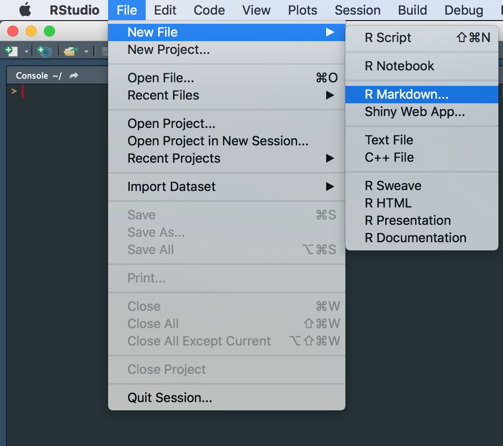
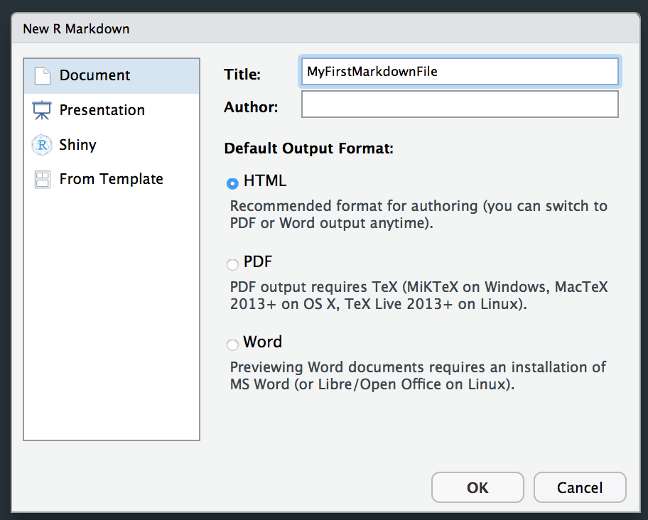
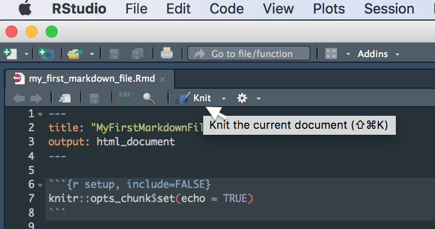

```{r setup, include=FALSE}
knitr::opts_chunk$set(echo = TRUE)
rmarkdown::find_pandoc(version = '2.9.1')
```


# The very basics
***

R Markdown is a great tool to document and share your work! R Markdown documents allow you to combine text, and code, images. 

## Setup document
Let's create your first R Markdown documents. 

1. Open RStudio
2. Create a new R Markdown file. To do so, click on *File -> New File -> R Markdown*

{width=50%}

This should prompt a dialog that allows you to choose whether you want your output to be in html, pdf or word format. For now, we will go with html, but you can always change this later. 


{width=50%}

This will provide you with a template for an R Markdown document. In this file, you will be able to write code and text, and even import images in R Studio. Sounds pretty awesome, doesn't it? 
Let't chickly safe the file so that we don't loose anything. Click on *File - Save* and give it a filename. 

## Knit
***

Now to really make things look pretty (aka compile the html document) we need to *knit* the file. In order to do so, simply click on *knit* on the top left. 

{width=50%}

Let's get starting filling this document with some content, but first of all, we should get rid of all the template content provided. Make sure to keep the header, and the piece of code that set's up the structure of the document, but delete everything below. You should just be left with this bit of the code:

````markdown
---
title: "Intro to R Markdown"
output: html_document:
---

`r ''````{r setup, include=FALSE}
knitr::opts_chunk$set(echo = TRUE)
`r ''````
````

# Basic R Markdown text production
***
Using R Markdown documents to write reports will likely mean you will want to include some text. 

### Headings
***

You can structure your reports by including headings and subsections. Headings are added by adding a `#` before your heading. Adding more `#` makes your heading a sub(or sub, or sub-sub-) heading. 

```
## Heading 2
### Heading 3
#### Heading 4
```
Which should look like this:

## Heading 2{.unlisted .unnumbered}
### Heading 3{.unlisted .unnumbered}
#### Heading 4{.unlisted .unnumbered}

Give this a try. Create a couple of headings in your report and type some text below. 

## Paragraphs
***

You create paragraphs by leaving an empty line between sentences. That is to say simply hitting enter won't do the job, you actually need to leave an empty line. 

```
This is your first sentence. 
This will NOT be a new paragraph. 

This however will be one!
```

Which looks like so:

This is your first sentence. 
This will NOT be a new paragraph. 

This however will be one!

Give this a try with the text you have added before. Create some paragraphs and subsections. 

## Text formatting
Lastly, you can make text *italic* (`*italic*`) or **bold** (`**bold**`), and include inline `code` (`` `code` ``). 

You can also include links `[text](link)`, i.e. `[Cambridge Neuroscience](https://www.neuroscience.cam.ac.uk)` get's you to [Cambridge Neuroscience](https://www.neuroscience.cam.ac.uk).  

## Code Blocks
***

The great thing about R Markdown is that you can add code directly into your report. This will allow you to add plots - and even show the code that produced it. 

You can add codeblocks either by clicking on `Code > Insert Chunk`, or by adding the following directly:

````markdown
`r ''````{r }

`r ''````
````

Give it a try. Let's add some code to your report. We will use the basic R dataset *iris*. As a first step, we probably want to get an idea of what the data looks like. Go ahead and create a new code chunk Now in that code chunk, type:

```{r eval=F}
head(iris)
```

If you now knit the file, you should see the head of the iris dataframe displayed:

```{r echo=F}
head(iris)
```

However, we also see the code you used to produce the table. If you just want to show your readers an overview of the dataframe, you won't need to show the code. We can hide it, by adding the option  `echo=F` to your code chunk like this:

````markdown
`r ''````{r echo = F}

`r ''````
````

## Tables
***
While the code above works well to demonstrate some options in R Markdown, the table that is output does not actually look too pretty. Let's change that. The `knitr::kable()` function allows you to easily create pretty tables. Try out changing the above `head(iris)` to:

```{r }
knitr::kable(
  head(iris), # This is the table we will plot
  booktabs = TRUE, # We determine the formatting style as 'booktabs'
  caption = 'A table that now looks much prettier.') # Here we are adding a caption 
```


## Figure Options
***
Perfect. Let's plot some data. 
Create a new code chunk and paste this code into it. Make sure you have the `ggplot2` library installed. If you haven't, install it first by typing `install.packages('ggplot2')` into the console. 

```{r eval = F}
library(ggplot2)
ggplot(iris, aes(x= Sepal.Length, color = Species, fill = Species, alpha = 0.4)) + 
  geom_density() + 
  theme_bw()
```

This should create a plot like this:

```{r echo = F, out.width= '70%', fig.align = "center"}
library(ggplot2)
ggplot(iris, aes(x= Sepal.Length, color = Species, fill = Species, alpha = 0.4)) + 
  geom_density() + 
  theme_bw()
```

Don't want people to see your code? Remember to add `echo = F`. Find the output too big? You can decide on the exact dimensions (in inches) by adding `fig.width = 3, fig.height = 2`. Alternatively, you could scale it to a percentage of the original dimensions using: `out.width = '50%'`. Lastly, decide how the figure should aligned using `fig.align = 'center'`. Go ahead and give some of these options a try. 


# External Images

Sometimes you may want to include an external image. Go ahead and download an image from the internet or locate one on your computer. I will be using this image of the [iris setosa](https://search.creativecommons.org/photos/87bb3e7a-1e47-44ed-88f8-c09bc0cbbf35). 

You can now include the image by adding an image title and the path to your image as such: ``. The easiest may be to move the image to wherever you saved your R Markdown file. Note that you can control the size of the image included by adding a scaling factor, i.e. `{width=50%}`.


{width=50%}

# YAML Header
Now that we actually have created some content, let's look at some styling options for our document.
The YAML header is the bit of code in the very beginning of your document:

````markdown
---
title: "MyFirstMarkdownFile"
output: html_document
---
````

Basically, YAML is like configuration code for your document.
Here, we can determine a whole range of options. You might be interested to add a table of contents to your file:

````markdown
---
title: "MyFirstMarkdownFile"
output:
  html_document:
    toc: true
---
````

You could decide to number your sections: 

````markdown
---
title: "MyFirstMarkdownFile"
output:
  html_document:
    toc: true
    number_sections: true
---
````

You could predetermine the size of the figures in your report so as to not have to set them again in each code chunk:

````markdown
---
title: "MyFirstMarkdownFile"
output:
  html_document:
    toc: true
    number_sections: true
    fig_width: 7
    fig_height: 6
    fig_caption: true
---
````

And you can choose from a number of themes as well as code syntax highlighting options. 
- `theme` determines the overall style. There are 12 themes you can use without installing any additional packages: `cerulean`, `cosmo`, `flatly`, `journal`, `lumen`, `paper`, `readable`, `sandstone`, `simplex`, `spacelab`, `united`, and `yeti`. 
- `highlight` allows you to determine the syntax highlighting for the code you include, making it easier to read. Try out a few of `default`, `tango`, `pygments`, `kate`, `monochrome`, `espresso`, `zenburn`, `haddock`, `breezedark`, and `textmate`.

For even more themes you could use, check out this [theme guide](https://www.datadreaming.org/post/r-markdown-theme-gallery/). 

````markdown
---
title: "MyFirstMarkdownFile"
output:
  html_document:
    toc: true
    number_sections: true
    fig_width: 7
    fig_height: 6
    fig_caption: true
    theme: journal
    highlight: tango
---
````

# Further resources
***
This [cheatsheet](https://rstudio.com/wp-content/uploads/2016/03/rmarkdown-cheatsheet-2.0.pdf?_ga=2.130692559.1531018005.1610984746-1259499429.1600070494) is a great resource to have at hand when you get started. 

[Here](https://rstudio.com/wp-content/uploads/2015/03/rmarkdown-reference.pdf) you find details on many more options to stylize your reports than we have discussed here. 

Lastly, check out the ['Definite Guide to R Markdown'](https://bookdown.org/yihui/rmarkdown/). 

