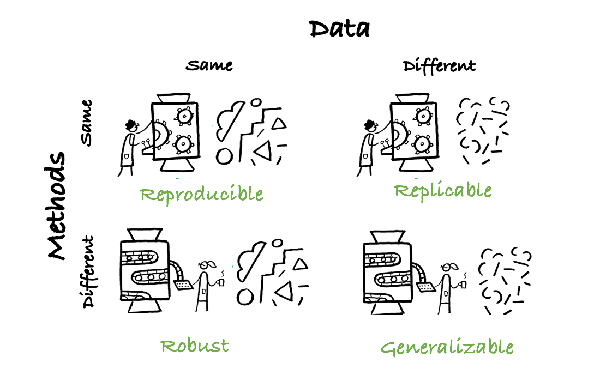

```{r setup, include=FALSE}
knitr::opts_chunk$set(echo = TRUE)
rmarkdown::find_pandoc(version = '2.9.1')
library(ggplot2)
library(dplyr)
library(magrittr)
```


# Why are we here?
***

This file will demonstrate some of the features of R Markdown. Most excitingly, we will actually get to use some **real** data and *reproduce* published results.  

As a reminder: 

> Open research aims to transform research by making it more reproducible, transparent, reusable, collaborative, accountable, and accessible to society. 

(The Turing Way Community, 2019)


## Advantages of Open Science
***

Thoughts on why open and reproducible research is the future:

* It creates trust in research results 
* It is the responsible thing to do with public research funding
* It is efficient
  + it saves time
  + reduces the costs of duplication
  + allows more research from the same data
* It allows knowledge transfer through fast, international, collaborative efforts
* ....


# Our Analysis
***
## Data
***
For this demonstration, we are using data from *1,500 scientists lift the lid on reproducibility
*, (Baker, 2016). Check out the article [here](https://www.nature.com/news/1-500-scientists-lift-the-lid-on-reproducibility-1.19970). The data is available through [figshare](https://figshare.com/articles/Nature_Reproducibility_survey/3394951/1). 

```{r }
# read in data
questionnaire = read.csv('Data/baker_2016_edited.txt', sep="\t")
```


Let's get an idea at what the data looks like. 

```{r }
knitr::kable(
  head(questionnaire[,c(1,11,28,29)]), # This is the table we will plot
  booktabs = TRUE, # We determine the formatting style as 'booktabs'
  caption = 'Data Overview, Baker 2016.') # Here we are adding a caption 
```

Interestingly, the figures in the report we got the data from appear to use only a subset of the data: The raw data includes more research fields than the authors plot. To show that, let's summarise the data:

```{r, echo=T, message=F}
participants <- questionnaire %>% group_by(field) %>% summarise(count = n())
```

So here are the number of subjects per field in the raw data:

```{r }
participants$prop = participants$count/sum(participants$count)*100
count.data <- participants %>%
  arrange(desc(field)) %>%
  mutate(lab.ypos = cumsum(count) - 0.5*count)

ggplot(count.data, aes(x="", y=count, fill=field))+
  geom_bar(width = 1, stat = "identity")+
  coord_polar("y", start=0) +
  labs('Field')+
  geom_text(aes(y = lab.ypos, label = round(prop,1)), color = "white")+
  theme_void() +
  theme(axis.title = element_blank())

```

```{r, eval=F, include=F}
knitr::kable(
  participants, # This is the table we will plot
  booktabs = TRUE, # We determine the formatting style as 'booktabs'
  caption = 'Number of Participants per Field') # Here we are adding a caption 
```


## Some Figures
***

Now this article doesn't only talk about open science - it also practices it! The data is freely available and under a creative commons [CC BY 4.0 ](https://creativecommons.org/licenses/by/4.0/) licence. 

Great stuff!

```{r echo = F, message=F}
fig3_plot = questionnaire[,c(22,23,29)]
fig3_plot = reshape(fig3_plot, direction="long", varying=1:2, timevar="question", v.names='response')
fig3_plot$question = as.factor(ifelse(fig3_plot$question == 1,"Own","Someone else's"))
fig3_plot$dummy = as.factor(ifelse(fig3_plot$response == 'Yes', fig3_plot$question, 0))

fig3_plot_perc <- fig3_plot %>% group_by(field,question,response) %>% 
 summarise(percentage=n()) %>% 
 group_by(field,question) %>% 
 mutate(percentage=percentage/sum(percentage)*100)

```

```{r out.width= '70%', fig.align = "center"}
ggplot(data=subset(fig3_plot_perc,response %in% 'Yes'), 
       aes(x=as.factor(reorder(field,percentage)),y=percentage,fill=factor(question))) +
  geom_bar(position="dodge",stat="identity") + 
  coord_flip() +
  ggtitle("Have you failed to reproduce an experiment?") +
  theme_bw()+
  theme(legend.title = element_blank(),
        axis.title = element_blank())
```

# External Images

Now mostly to demonstrate how to integrate images, but also as a brief reminder of some terminology, let's integrate an external image:


<center>
{width=50%}
<center>


# Further resources
***
This [cheatsheet](https://rstudio.com/wp-content/uploads/2016/03/rmarkdown-cheatsheet-2.0.pdf?_ga=2.130692559.1531018005.1610984746-1259499429.1600070494) is a great resource to have at hand when you get started. 


