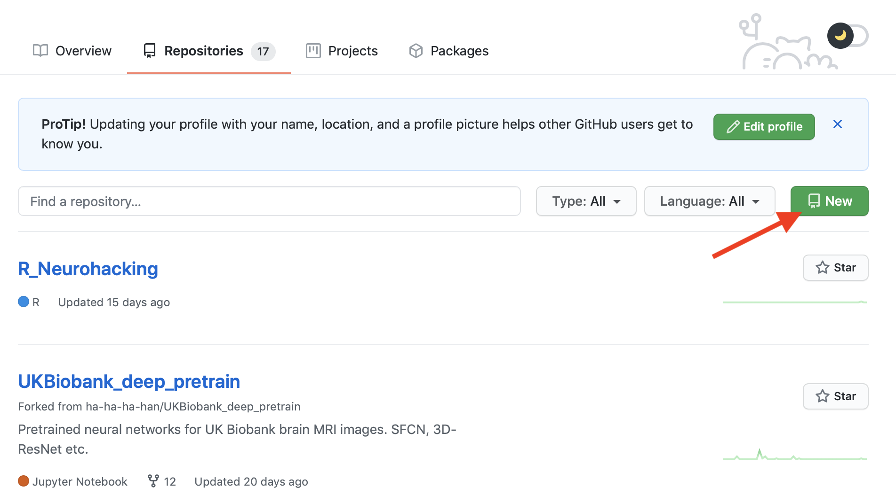
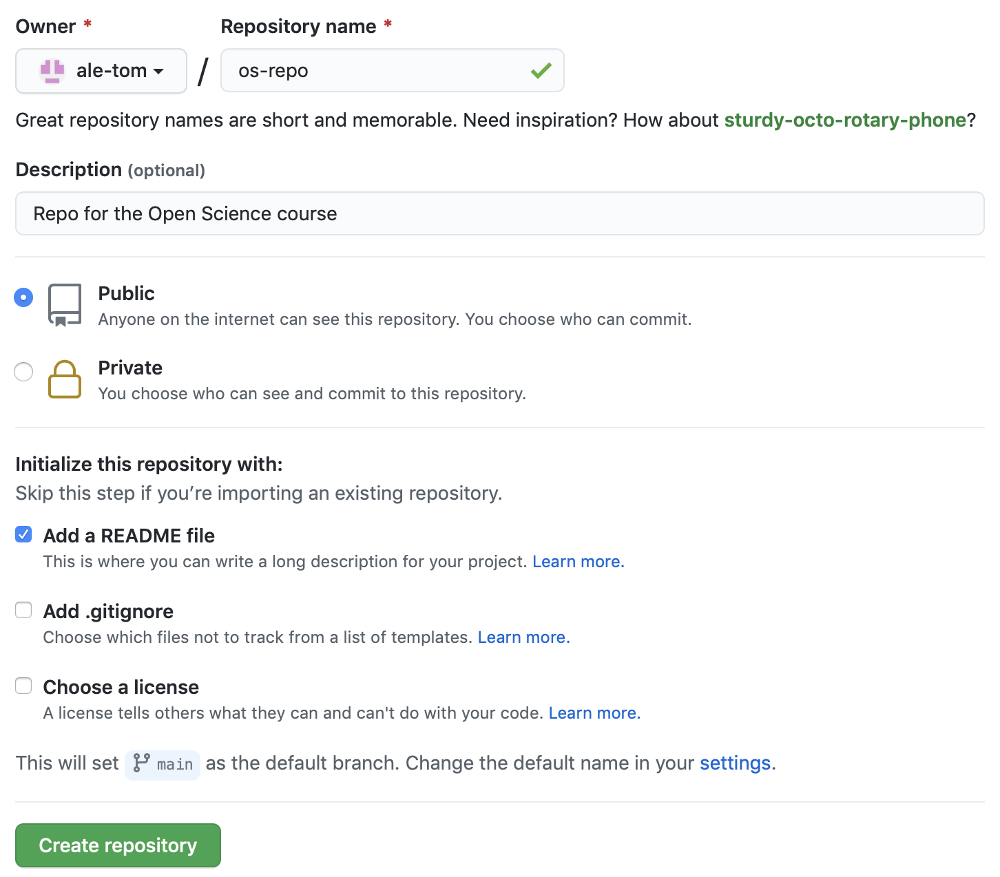

```{=html}

```
```{r setup, include=FALSE}
knitr::opts_chunk$set(echo = TRUE)

```
```{r load_packages, message=FALSE,warning=FALSE,include=FALSE}
   library(fontawesome)
```

# Introduction to Open Data Science

**MPhil in Basic and Translational Neuroscience - Lent Term**

------------------------------------------------------------------------

 `r fa("calendar-alt", height = 17, fill = "steelblue")`  January 18 2021
 
 `r fa("clock", height = 17, fill = "steelblue")`  10:00 - 12:00
 
 `r fa("map-marked-alt", height = 17, fill = "steelblue")`  Zoom


------------------------------------------------------------------------

## Pre-work

 

Please do the following Git/GitHub prep in advance:

 

1.  Create a GitHub account at <https://github.com>, if you don't already have one. A few tips:

    -   For username, I recommend all lower-case letters, as short as you can.

    -   I suggest using your ".ac.uk" email, since you can request free private repositories via GitHub Education.

    -   Ideally incorporate your actual name, it makes your username easier for people to remember.

    -   Re-use your username from other contexts e.g. Twitter.

         

         

2.  Log into your GitHub account, go to "repositories" and create a new repository called "os_repo":\

    {width="70%"}

 

 

3.  Call the repository "os-repo", add a description, make it public, create a README FILE.\
    Please, just skip the Add gitignore and Add a license options.

    \
    {width="70%"}

     

     

4.   Install Git from here: <http://git-scm.com/downloads>.\
    You can find the instructions to install Git here: <https://git-scm.com/book/en/v2/Getting-Started-Installing-Git>.
    
    
```{r eval=FALSE, message=FALSE, warning=FALSE, include=TRUE}
prova
```
    

------------------------------------------------------------------------

## Instructors

 

-   **Dr Alessandro Tomassini** - *MRC Cognition and Brain Sciences Unit* \|  `r fa("envelope", height = 12, fill = "steelblue")`  [alessandro.tomassini\@mrc-cbu.cam.ac.uk](mailto:alessandro.tomassini@mrc-cbu.cam.ac.uk)

-   **Ms Lena Dorfschmidt** - *Department of Psychiatry* \|  `r fa("envelope", height = 12, fill = "steelblue")` [ld548\@cam.ac.uk](mailto:ld548@cam.ac.uk)


 

 
