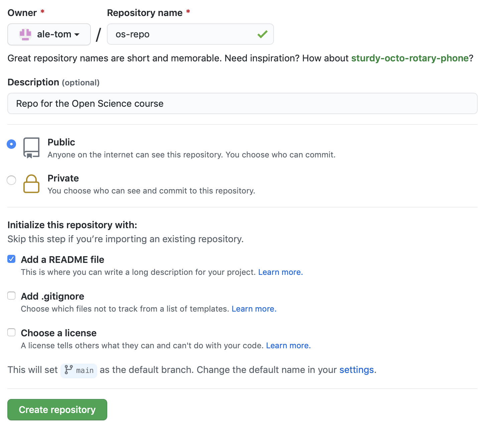

Introduction to Open Data Science
================


## MPhil in Basic and Translational Neuroscience - Lent Term

------------------------------------------------------------------------


January 18 2021


10:00 - 12:00


Zoom

------------------------------------------------------------------------

## Pre-work

 

Please do the following Git/GitHub prep in advance:

 

1.  Create a GitHub account at <https://github.com>, if you don’t
    already have one. A few tips:

    -   For username, I recommend all lower-case letters, as short as
        you can.

    -   I suggest using your “.ac.uk” email, since you can request free
        private repositories via GitHub Education.

    -   Ideally incorporate your actual name, it makes your username
        easier for people to remember.

    -   Re-use your username from other contexts e.g. Twitter.

         

         

2.  Log into your GitHub account, go to “repositories” and create a new
    repository called “os\_repo”:  

    

 

 

1.  Call the repository “os-repo”, add a description, make it public,
    create a README FILE.  
    Please, just skip the Add gitignore and Add a license options.

      
    

     

     

2.   Install Git from here: <http://git-scm.com/downloads>.  
    You can find the instructions to install Git here:
    <https://git-scm.com/book/en/v2/Getting-Started-Installing-Git>.

``` r
prova
```

------------------------------------------------------------------------

## Instructors

 

-   **Dr Alessandro Tomassini** - *MRC Cognition and Brain Sciences
    Unit* \|
    <svg style="height:12;fill:steelblue;" viewBox="0 0 512 512"><path d="M502.3 190.8c3.9-3.1 9.7-.2 9.7 4.7V400c0 26.5-21.5 48-48 48H48c-26.5 0-48-21.5-48-48V195.6c0-5 5.7-7.8 9.7-4.7 22.4 17.4 52.1 39.5 154.1 113.6 21.1 15.4 56.7 47.8 92.2 47.6 35.7.3 72-32.8 92.3-47.6 102-74.1 131.6-96.3 154-113.7zM256 320c23.2.4 56.6-29.2 73.4-41.4 132.7-96.3 142.8-104.7 173.4-128.7 5.8-4.5 9.2-11.5 9.2-18.9v-19c0-26.5-21.5-48-48-48H48C21.5 64 0 85.5 0 112v19c0 7.4 3.4 14.3 9.2 18.9 30.6 23.9 40.7 32.4 173.4 128.7 16.8 12.2 50.2 41.8 73.4 41.4z"/></svg>
    <alessandro.tomassini@mrc-cbu.cam.ac.uk>

-   **Ms Lena Dorfschmidt** - *Department of Psychiatry* \|
    <svg style="height:12;fill:steelblue;" viewBox="0 0 512 512"><path d="M502.3 190.8c3.9-3.1 9.7-.2 9.7 4.7V400c0 26.5-21.5 48-48 48H48c-26.5 0-48-21.5-48-48V195.6c0-5 5.7-7.8 9.7-4.7 22.4 17.4 52.1 39.5 154.1 113.6 21.1 15.4 56.7 47.8 92.2 47.6 35.7.3 72-32.8 92.3-47.6 102-74.1 131.6-96.3 154-113.7zM256 320c23.2.4 56.6-29.2 73.4-41.4 132.7-96.3 142.8-104.7 173.4-128.7 5.8-4.5 9.2-11.5 9.2-18.9v-19c0-26.5-21.5-48-48-48H48C21.5 64 0 85.5 0 112v19c0 7.4 3.4 14.3 9.2 18.9 30.6 23.9 40.7 32.4 173.4 128.7 16.8 12.2 50.2 41.8 73.4 41.4z"/></svg>
    <ld548@cam.ac.uk>

 

 
