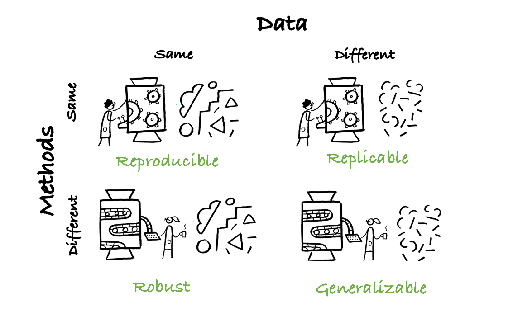
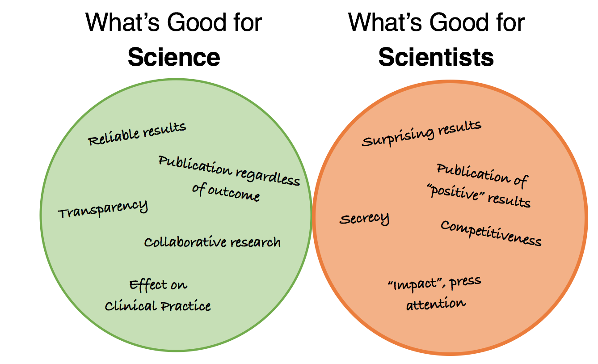
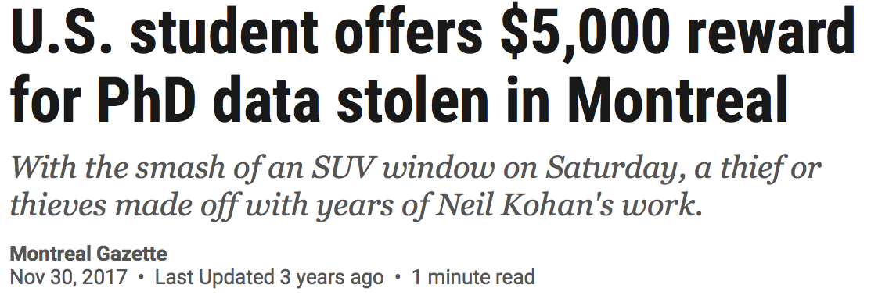
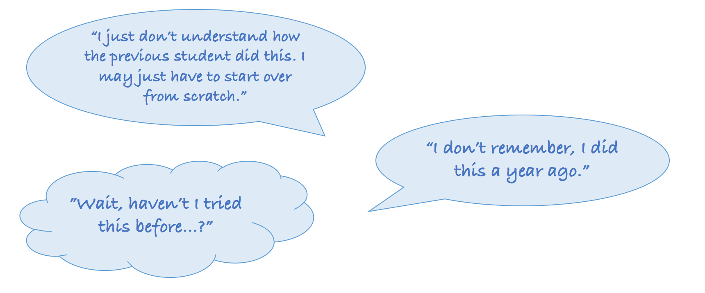
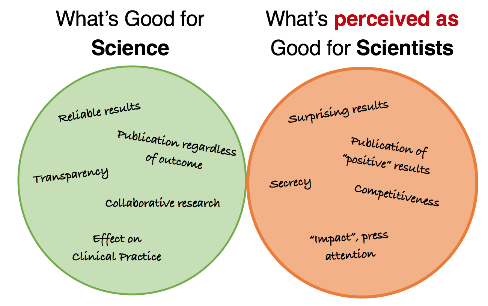
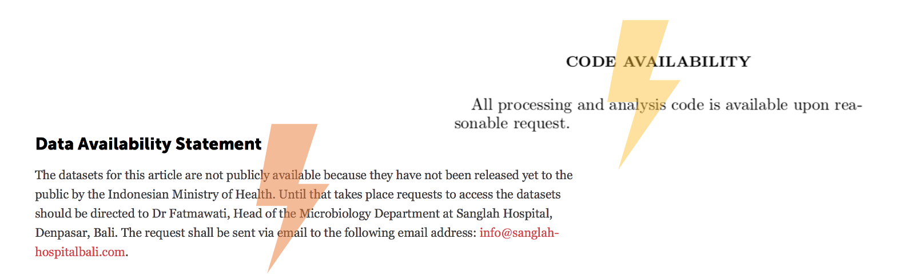
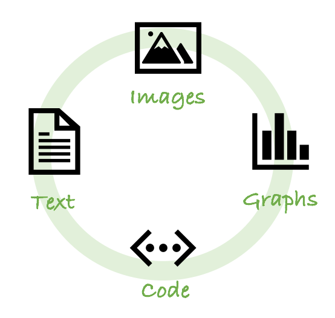
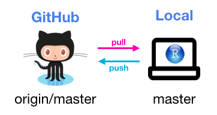

```{r setup, include=FALSE}
options(htmltools.dir.version = FALSE)

```


```{r use-logo, echo=FALSE}
xaringanExtra::use_logo("logo_uni.jpg",exclude_class = c( "hide-logo"), width = "200px")
```

# Science is NOT a Miracle!


---

# What are we talking about?

.center[]

---

# Mismatch in Interest
.center[]


---
# 5 Selfish Reasons to Work Reproducibly
```{r xaringan-panelset, echo=FALSE}
xaringanExtra::use_panelset()
xaringanExtra::use_editable()
```
.panelset[
.panel[.panel-name[1]
##Reproducibility helps avoid disaster
 
.center[]


]

.panel[.panel-name[2]
##Reproducibility helps writing papers
Well documented and accessible code and data...
  - ...allow you to look up numbers easily.
  - ...help you spot mistakes. 
  - ...can go right into your paper.
  - ...no more stressfull 'I will just sort the code out when we want to publish this.'
]

.panel[.panel-name[3]
##Reproducibility helps reviewers see it your way
   - helps reviewer's understand your results better - and maybe even try out their own suggestions for improvement


]

.panel[.panel-name[4]
##Reproducibility enables continuity 
 .center[]
]

.panel[.panel-name[5]
##Reproducibility helps to build your reputation
  - toolboxes, libraries, software packages can all go on your CV
]

]
---


# *Apparent* Mismatch in Interest
.center[]

---
# How to get started
Open research transforms science by aiming to make each part of the process (*data, software, hardware, results*):

- ...**publicly available**, so that anyone can benefit of it, without restrictions through paywalls and password. 
- ...**transparent**, such that results and data can be accessed and reproduced with ease, ensuring time and effort goes into building on them.  
- ...**reusable**, that is licensed appropiately, so that users know what they can and cannot do with it. 

.center[]

---
# How to get started: Data
.center[]


---

# How to get started: Code

R Markdown allows you to share your work - code, text, images, graphs - all in one document. 

.pull-left[
.center[]
]

.pull-right[
.center[]
]


---
# Further Resources

Baker, M. (2016). 1,500 scientists lift the lid on reproducibility. Nature, 533(7604), 452–454. https://doi.org/10.1038/533452a 

Markowetz, F. (2016). 5 selfish reasons to work reproducibly. Talk at scidata 2016. https://www.youtube.com/watch?v=Is15CMVPHas&feature=youtu.be

The Turing Way Community, Becky Arnold, Louise Bowler, Sarah Gibson, Patricia Herterich, Rosie Higman, … Kirstie Whitaker. (2019, March 25). The Turing Way: A Handbook for Reproducible Data Science (Version v0.0.4). Zenodo. http://doi.org/10.5281/zenodo.3233986

Check out their [Youtube Channel](https://www.youtube.com/channel/UCPDxZv5BMzAw0mPobCbMNuA/videos) and [Website](https://the-turing-way.netlify.app/welcome.html)


---
class:  center, middle

# Let's get started

---

# R Markdown

Reproducible papers: The idea that any paper can be obtained, its source material being handy, and then any change anyone likes can be made to it.

.panelset[
.panel[.panel-name[What is it?]
  - R Markdown is an add-on package to R
  - It allows to write a single document that combines:
          - Text
          - Code
          - Plots
          - Images
          - Videos
          - Equations
  - It is extremely versatile and can render the document in various formats:
          - PDF
          - MS Words
          - Web page
          - Book
          - Slides...actually these slides are based on R Markdown!


]

.panel[.panel-name[Reproducible]

<br/>

*"The provision of enough detail about study procedures and data so the same procedure could [..] be exactly repeated"*  <font size = "2">(Goodman et al., 2016)</font>

<br/>

  - Removes all guesswork regarding your data analysis and reporting
  
  <br/>

  
  - A work can be reproduced by simply downloading and running a R Markdown document
  
  
]

.panel[.panel-name[Other benefits]
<br/>

  - Increases the quality of scientific outputs by forcing researchers to be careful, thorough, and explicit
 
  
  - Increases the likelihood that any errors will be spotted early, instead of down the line (saves time, money, and pride)
  
  
  - A clear computational workflow makes it easy to re-run analyses or to re-use data from past experiments
  
  
  - Easy to learn
  

]

]


---

# GitHub

Version controls is an approach to  record changes made in a file over time
.panelset[
.panel[.panel-name[What is it?]

<br/>

 - **Git** is a version control system to manage the evolution of a set of files - called a **repository**
 
 - **GitHub** is a web service (like GitLab and Bitbucket) for storing git repositories online
 
 - ** Versioning** is the management of changes or revisions made in a file or project

]

.panel[.panel-name[Reproducibility]

<br/>

- Changes to files at any time can be tracked and reviewed

- Changes are documented and explained by **commit messages** 

- Commit messages and comments are helpful to understand changes in files or analytical decisions

- Overall, version control makes analyses **auditable** and **reproducible**

]
.panel[.panel-name[How does it work?]
## Basic workflow

.pull-left[
- **Pull** changes done to the remote repository into the local repository
  
- Work locally
  
- **Stage**, i.e.select changed files

- **Commit**, i.e. record changes to the file's history

- **Push** changes to the remote repository

]

.pull-right[ 

 <font size = "2"> *Image by [edav.info](https://edav.info/github.html)]* </font>

]
  


.panel[.panel-name[Collaborative]
## Fork-merge workflow

.pull-left[
- **Fork** someone's repository 
  
- Work locally 
  
- Make a **pull request**  to implement your changes

- Maintainers need to approve changes

- Changes approved and fork **merged** to main repository


]

.pull-right[

<font size = "2"> *Image by G. Lionetti via [Atlassian](https://www.atlassian.com/blog/archives/stash-git-forking-development-workflow)]* </font>

  
  
]

]


---

# Open Science Framework
Open source project management tool: supports the whole project's lifecycle
.panelset[
.panel[.panel-name[Pre-registration]
*"The specification of a research design, hypotheses and analysis plan prior to  observing the outcomes of a study"* <font size = "2">Nosek & Lindsay (2018)</font>

<br/>

 - Follows established templates

 - Power sensitivity analysis
 
 - Predefined hypotheses (*separating exploratory from confirmatory research*)
 
 - Predefined analytical plan (*improves transparency*)
 
 - Time-stamped
 
 - Can be embargoed until acceptance of paper

]

.panel[.panel-name[Data & code storage]

<br/>

- Free and open data/code storage

- Storage locations in US, Canada, Germany, Australia (*choose Germany for GDPR compliance*) 

- Storage capped to 50GB for public projects (*suitable for processed neuroimaging data*)

- It can interface to other storage services:
  .pull-left[
- GitHub
- GitLab
- Google Drive
- OneDrive
- OwnCloud]

 .pull-right[- GitHub
- Amazon S3
- Dropbox
- Figshare
- Dataverse]

]

.panel[.panel-name[Versioning]

<br/>
<br/>
- Allows version control of the project (*obviously less flexible than GitHub*)
  
- Allows both basic and collaborative workflows

- Can be directly linked to a GitHub repository

- Allows to edit text files (including R and Python scripts) directly in the browser


  
  
]

.panel[.panel-name[Preprints]
## Fork-merge workflow


- Indexed in Google Scholar for maximum discoverability
  
- Creates a Digital Object Identifier (DOI)  

- Not yet a peer-reviewed paper but it is citable
  
- Time-stamped upon creation (*prevents scooping*)

- Note, preprints can be shared only on one preprint server (*e.g. either osf or bioRxiv etc*)


]

]


---

class: center, middle
# Questions?

---
class:  center, middle
# Now try your hands!

---


