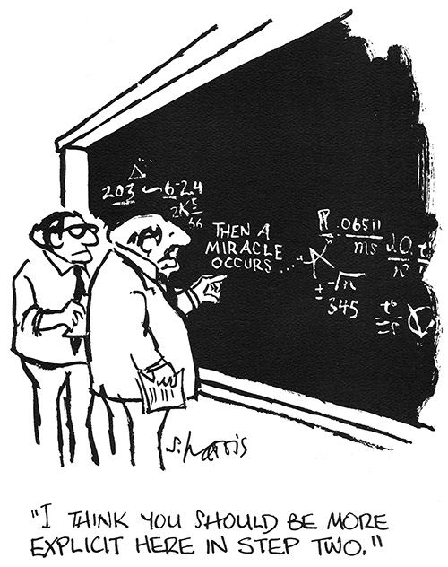

```{r setup, include=FALSE}
options(htmltools.dir.version = FALSE)

```


```{r use-logo, echo=FALSE}
xaringanExtra::use_logo("logo_uni.jpg",exclude_class = c( "hide-logo"), width = "200px")
```

# Science is NOT a Miracle!

.center[]

---

# What are we talking about?

.center[]

---

# What is standing in our way?


---

# Mismatch in Interest
.center[]


---
# 5 Selfish Reasons to Work Reproducibly
```{r xaringan-panelset, echo=FALSE}
xaringanExtra::use_panelset()
xaringanExtra::use_editable()
```
.panelset[
.panel[.panel-name[1]
##Reproducibility helps avoid disaster
 
.center[]


]

.panel[.panel-name[2]
##Reproducibility helps writing papers
Well documented and accessible code and data...
  - ...allow you to look up numbers easily.
  - ...help you spot mistakes. 
  - ...can go right into your paper.
  - ...no more stressfull 'I will just sort the code out when we want to publish this.'
]

.panel[.panel-name[3]
##Reproducibility helps reviewers see it your way

]

.panel[.panel-name[4]
##Reproducibility enables continuity 
 .center[]

 
]

.panel[.panel-name[5]
##Reproducibility helps to build your reputation

]

]
---


# *Apparent* Mismatch in Interest
.center[]


---
# How to get started
.center[]


---


# Open Science: Pros vs Cons

.pull-left[
### &#x1F917; Pros

.can-edit.key-likes[
- Promotes rigor
]
]

.pull-right[
### &#x1F620; Cons

.can-edit.key-dislikes[
- Takes time
]
]

---
class:  center, middle

# Let's get started

---

# R Markdown

Reproducible papers: The idea that any paper can be obtained, its source material being handy, and then any change anyone likes can be made to it.

.panelset[
.panel[.panel-name[What is it?]
  - R Markdown is an add-on package to R
  - It allows to write a single document that combines:
          - Text
          - Code
          - Plots
          - Images
          - Videos
          - Equations
  - It is extremely versatile and can render the document in various formats:
          - PDF
          - MS Words
          - Web page
          - Book
          - Slides...actually these slides are based on R Markdown!


]

.panel[.panel-name[Reproducible]

<br/>

*"The provision of enough detail about study procedures and data so the same procedure could [..] be exactly repeated"* (Goodman et al., 2016)

<br/>

  - Removes all guesswork regarding your data analysis and reporting
  
  <br/>

  
  - A work can be reproduced by simply downloading and running a R Markdown document
  
  
]

.panel[.panel-name[Other benefits]
<br/>

  - Increases the quality of scientific outputs by forcing researchers to be careful, thorough, and explicit
 
 <br/>
  
  - Increases the likelihood that any errors will be spotted early, instead of down the line (saves time, money, and pride)
  
  <br/>
  
  - A clear computational workflow makes it easy to re-run analyses or to re-use data from past experiments
  
   <br/>
  
  - Easy to learn
  

]

]


---

# GitHub

Version controls is an approach to  record changes made in a file over time
.panelset[
.panel[.panel-name[What is it?]

<br/>

 - **Git** is a version control system to manage the evolution of a set of files - called a **repository**
 
 - **GitHub** is a web service (like GitLab and Bitbucket) for storing git repositories online
 
 - ** Versioning** is the management of changes or revisions made in a file or project

]

.panel[.panel-name[Reproducibility]

<br/>

- Changes to files at any time can be tracked and reviewed

- Changes are documented and explained by **commit messages** 

- Commit messages and comments are helpful to understand changes in files or analytical decisions

- Overall, version control makes analyses **auditable** and **reproducible**

]
.panel[.panel-name[How does it work?]
## Basic workflow

.pull-left[
- **Pull** changes done to the remote repository into the local repository
  
- Work locally
  
- **Stage**, i.e.select changed files

- **Commit**, i.e. record changes to the file's history

- **Push** changes to the remote repository

]

.pull-right[ 

 <font size = "2"> *Image by [edav.info](https://edav.info/github.html)]* </font>

]
  


.panel[.panel-name[Collaborative]
## Fork-merge workflow

.pull-left[
- **Fork** someone's repository 
  
- Work locally 
  
- Make a **pull request**  to implement your changes

- Maintainers need to approve changes

- Changes approved and fork **merged** to main repository


]

.pull-right[

<font size = "2"> *Image by G. Lionetti via [Atlassian](https://www.atlassian.com/blog/archives/stash-git-forking-development-workflow)]* </font>

  
  
]

]


---

# Open Science Framework
Open source project management tool: supports the whole project's lifecycle
.panelset[
.panel[.panel-name[Pre-registration]

<br/>

 - Power sensitivity analysis
 
 - Predefined hypotheses
 
 - Predefined analytical plan
 
 - Time-stamped
 
 - Generates a unique Digital Object Identifier (DOI)
 
 - Can be embargoed until acceptance of paper

]

.panel[.panel-name[Data & code storage]

<br/>

- Changes to files at any time can be tracked and reviewed

- Changes are documented and explained by **commit messages** 

- Commit messages and comments are helpful to understand changes in files or analytical decisions

- Overall, version control makes analyses **auditable** and **reproducible**

]
.panel[.panel-name[Versioning]
## Basic workflow

.pull-left[
- Allows version control of the project
  
- Allows both basic and collaborative workflows

- Can be directly linked to a GitHub repository

- **Push** changes to the remote repository
]

.pull-right[ ]

  
  
]

.panel[.panel-name[Preprints]
## Fork-merge workflow

.pull-left[
- Indexed in Google Scholar for maximum discoverability
  
- Creates a Digital Object Identifier (DOI)  
  
- Make a **pull request**  to implement your changes

- Maintainers need to approve changes

- Changes approved and fork **merged** to main repository


]

.pull-right[ ]

  
  
]

]


---

class: center, middle
# Questions?

---
class:  center, middle
# Now try your hands!

---


